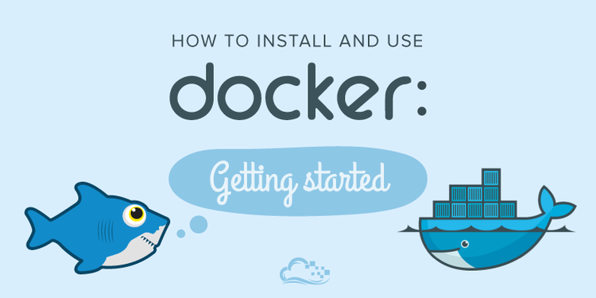

Boilerplate Application v1.2
=============================



## System Preparation

To use this starter project, you'll need the following things installed on your machine.

1. [NodeJS](http://nodejs.org) - use the installer.
2. [GulpJS](https://github.com/gulpjs/gulp) - `$ npm install -g gulp` (mac users may need sudo)

## Local Installation

1. Clone this repo, or download it into a directory of your choice.
2. Inside the directory, run `npm install`.

## Usage

**development mode**

This will give you file watching, browser synchronisation, auto-rebuild, CSS injecting etc etc.

```shell
$ gulp
```


<!--
## Deploy with Gulp

You can easily deploy your site build to a gh-pages branch. First, follow the instructions at [gulp-gh-pages](https://github.com/rowoot/gulp-gh-pages) to get your branch prepared for the deployment and to install the module. Then, in `gulpfile.js` you'll want to include something like the code below. `gulp.src()` needs to be the path to your final site folder, which by default will be `_site`. If you change the `destination` in your `_config.yml` file, be sure to reflect that in your gulpfile.


```javascript
var deploy = require("gulp-gh-pages");

gulp.task("deploy", ["jekyll-build"], function () {
    return gulp.src("./_site/**/*")
        .pipe(deploy());
});
```
-->
Hosting Server: Digital Ocean or Amazon Web Services
  cPanel (Creating E-mail Accounts, FTP)
  Upload a site with FTP[FileZilla]
  Register a domain name and learn about DNS / Name Servers
  cloud Storage: Amazon S3
Monitoring: Grafana
Artificial Intelligence:
Version Control Repository: GIT
Transportation/Implementation:  Docker
Task Runner:  Gulp
Module loader:  Webpack (JS Bundler)
JS compiler:  Babel (ES6/ES7 Standard)
Database:  MongoDB, MySQL, Oracle, Firebase (cloud+GOOGLE)
Content Management Systems:  Wordpress

Basic Command Line (folder navigation, file creation)
API's/REST(the future)

node.js = JavaScript on the Server side vs. Browser + NPM (node package manager)
Learn PYTHON = Important language to learn (then C#, then maybe PHP)
